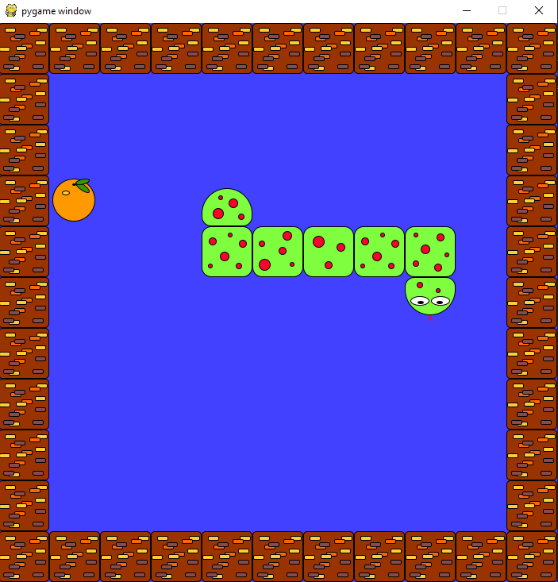

## Pygame Snake

A quick implementation of the game snake, using pygame. The focus was learning and practising python, but I got bored, as I learned that I'd prefer nearly any library or langauge other then pygame and python. I need multiline lambdas, and simpler object definitions.

# Usage

`pip install pygame`

`cd src`

`python game.py`

# TODOS

* Add the ability to lose (seems important).
* Add game states and some sort of UI.